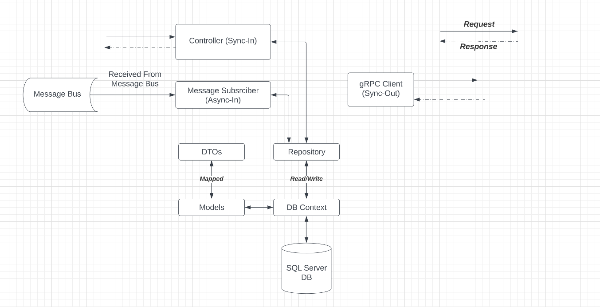
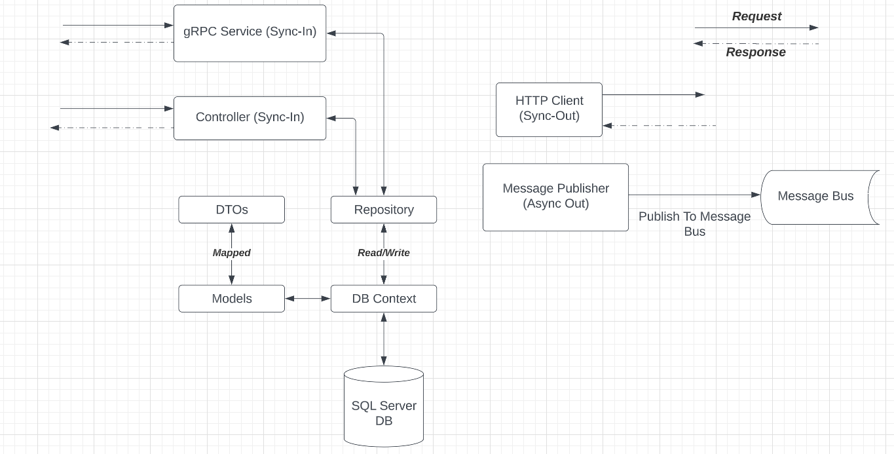

# NETInfra

After gaining experience in SWE, I realized the importance behind agile engineering and communication between various industries of IT - SWE, DevOps, etc. I personally believe the lack of agile and communication causes obstacles that many companies face, which is completely okay!

So, although its prevalance and contribution to society is minimal, I felt like creating an application that helps us developers resolve issues we often face on a day-to-day basis; monitoring technology, debugging access and errors, etc., was a way where I can personalize the application of relevant industry skills to help others.

Hence the creation of NETInfra, a infrastructure management tool for software teams.

P.S: I decided to expand on my CommandSnippetAPI project by adding more services and microservice architecture. Safe to say it was not easy.

### Architecture

#### Solution Architecture

#### Platform Service Architecture

#### Command Service Architecture

### DevOps

- Docker for containerization.
- Kubernetes for orchestration.
- Nginx Ingress Controller for load-balancing and routing traffic.

### Messaging

- RabbitMQ :- Publisher/Consumer model.
- gRPC :- CommandsService => PlatformService

### Database

- Microsoft SQL Server for PlatformService.
- In memory DB for CommandsService.

### Microservices

- Platform Service
  - Handles management of platforms.
  - Publishes platforms to the message broker.
- Commands Service
  - Handles management of commands.
  - Receives platforms from message broker and associates them to commands.
  - Automatically updates Platform Service when commands are attached to platforms
